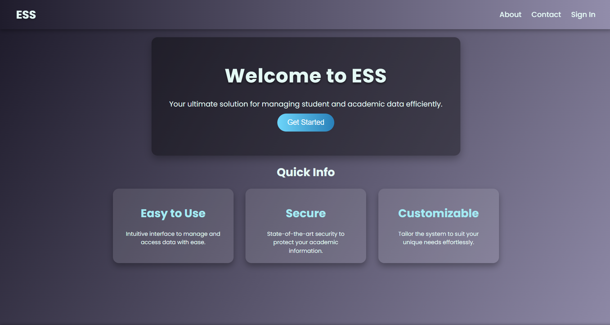
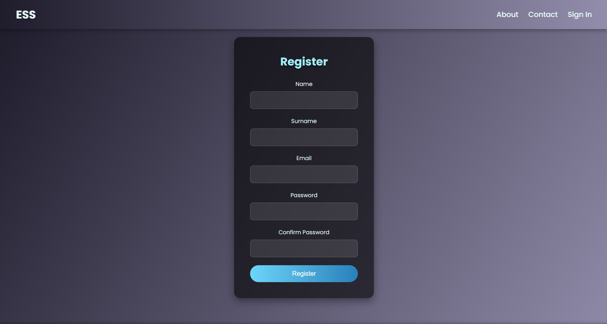
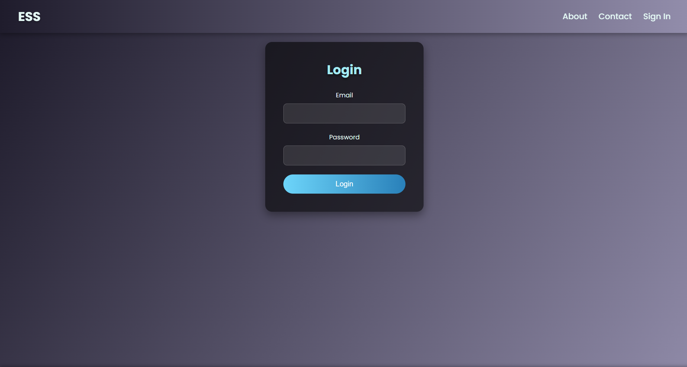
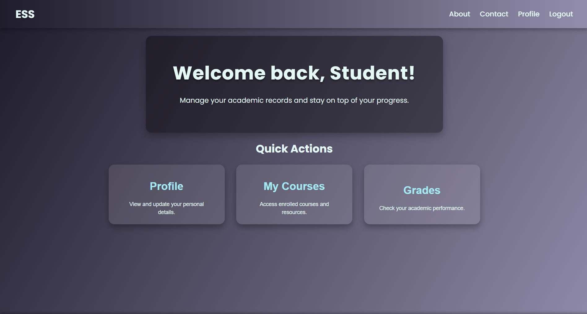
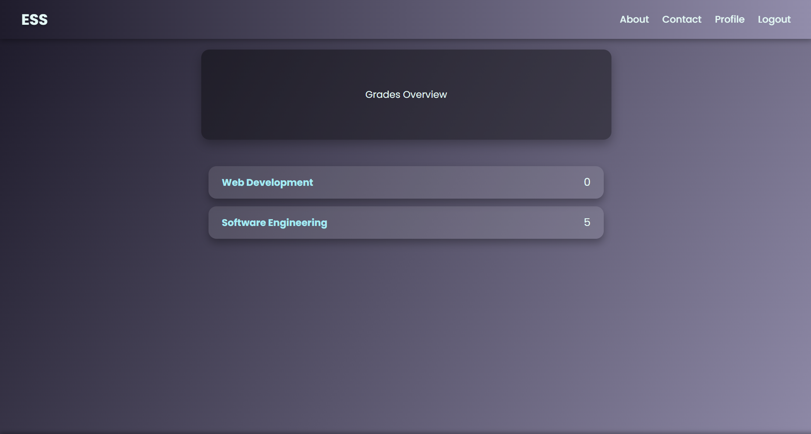
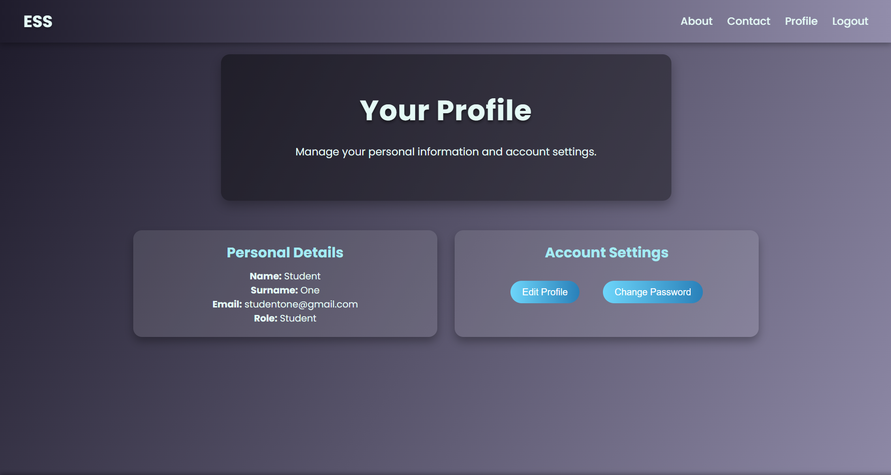
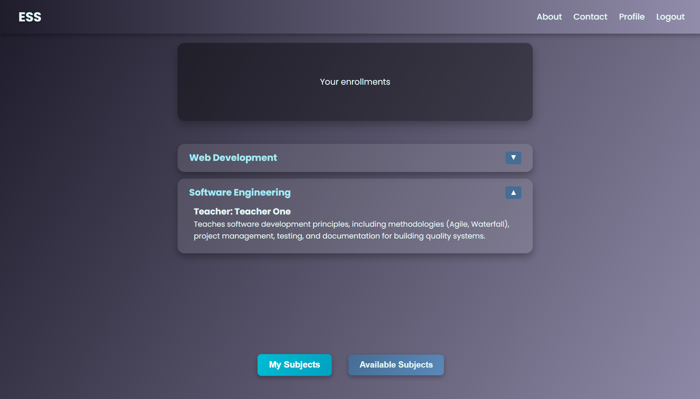
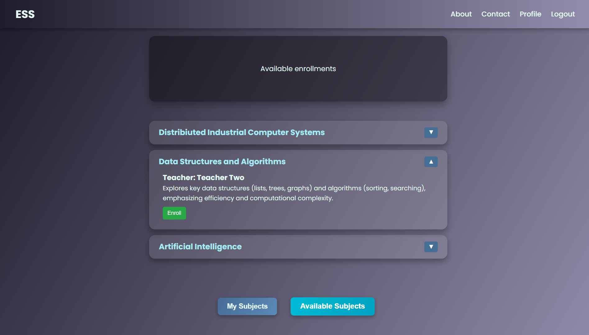
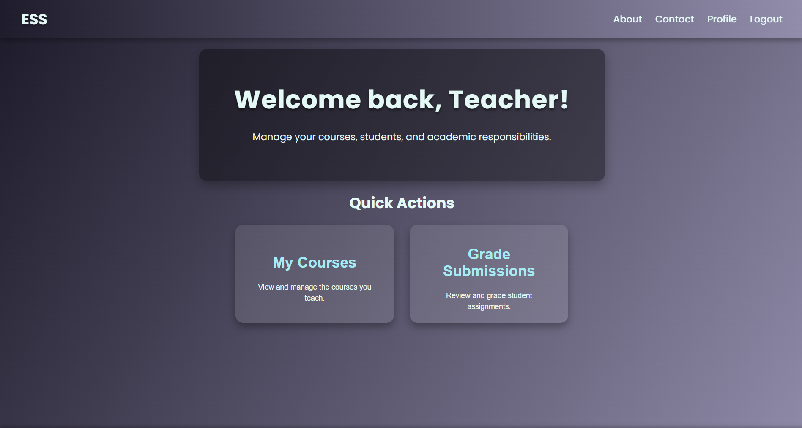
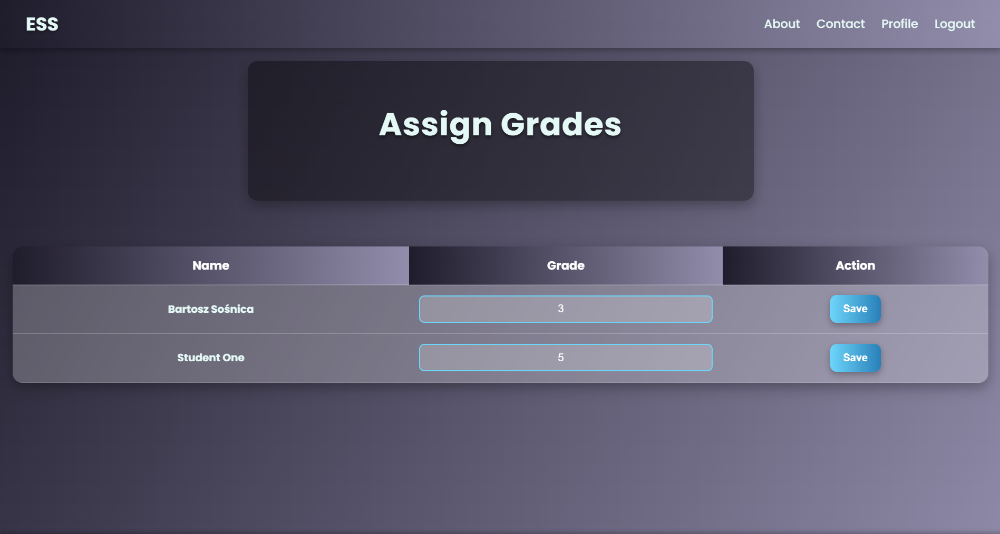

# Extended Student System

**ESS** is a full-stack web application designed to manage and store student-related data efficiently. Built for universities and academic institutions, the platform allows administrators to manage student records, courses, grades, and performance data in a centralized, user-friendly environment. It supports secure user authentication and roles, providing different access levels for administrators, teachers, and students. The system ensures that academic data is organized, searchable, and always accessible.

## Features
 - Role-based authentication (Admin, Teacher, Student)
 - Add and manage student records and academic data
 - Assign courses and grades to students
 - View academic performance dashboards
 - PostgreSQL database hosted on Supabase
 - RESTful API backend with Spring Boot

## Live URL

https://ess-three.vercel.app/

## Screenshots

### Home Page

### Sign Up Page

### Sign In Page

### Student Home Page

### Student's Grades

### Student Details

### Student Enrollments

### Student Available Enrollments

### Teacher Home Page

### Teacher Assign Grades Page

## Technologies

### Frontend
 - Angular

### Backend
 - Java Spring Boot (REST API)

### Database
 - Supabase (PostgreSQL)

### Development Tools
 - Postman
 - VS Code
 - IntelliJ IDEA
 - Prettier

## Contact
For inquiries or contributions, feel free to reach out via:

- bartoszsosnica@gmail.com
